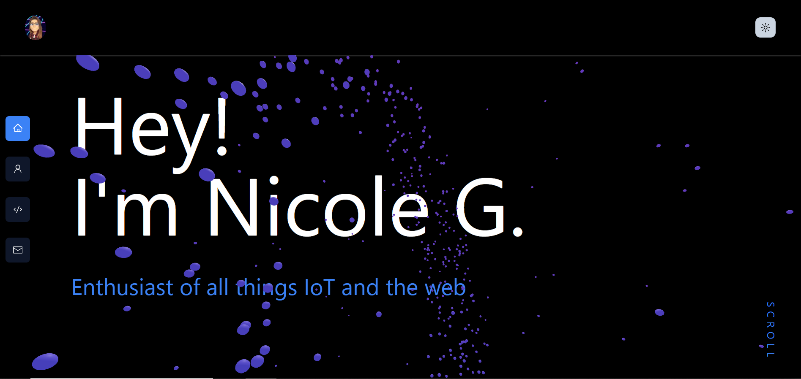

<!-- Improved compatibility of back to top link: See: https://github.com/othneildrew/Best-README-Template/pull/73 -->
<a name="readme-top"></a>
<!--
*** Thanks for checking out the Best-README-Template. If you have a suggestion
*** that would make this better, please fork the repo and create a pull request
*** or simply open an issue with the tag "enhancement".
*** Don't forget to give the project a star!
*** Thanks again! Now go create something AMAZING! :D
-->

[![LinkedIn][linkedin-shield]][linkedin-url]

<!-- PROJECT LOGO -->
<br />
<div align="center">
  <a href="https://github.com/lpurgitoryl/next-portfolio/">
    
  </a>

<h3 align="center">Nextjs Portfolio</h3>

  <p align="center">
      A simple customizable personal portfolio website using Nextjs and Contentlayer.
    <br />
    <br />
    <br />
    <a href="https://nicolegarcia.vercel.app/">View Demo</a>
  </p>
</div>

<!-- TABLE OF CONTENTS -->
<details>
  <summary>Table of Contents</summary>
  <ol>
    <li>
      <a href="#about-the-project">About The Project</a>
      <ul>
        <li><a href="#built-with">Built With</a></li>
      </ul>
    </li>
    <li>
      <a href="#getting-started">Getting Started</a>
      <ul>
        <li><a href="#prerequisites">Prerequisites</a></li>
        <li><a href="#installation">Installation</a></li>
      </ul>
    </li>
    <!-- <li><a href="#contact">Contact</a></li> -->
    <li><a href="#acknowledgments">Acknowledgments</a></li>
  </ol>
</details>

<!-- ABOUT THE PROJECT -->
## About The Project

After learning react, I wanted to update my personal site and decided to use nextjs! I also wanted to make this site easy to customize for other devs to use. I hope you like it!  

<p align="right">(<a href="#readme-top">back to top</a>)</p>

### Built With

![Nextjs]
![Threejs]
![HTML]
![CSS]
![Tailwind]
![Vercel]


<p align="right">(<a href="#readme-top">back to top</a>)</p>

<!-- GETTING STARTED -->
## Getting Started

### Prerequisites

Make sure you have npm installed with

* npm

  ```sh
  npm install npm@latest -g
  ```

### Installation

1. Clone the repo

   ```sh
   git clone https://github.com/lpurgitoryl/next-portfolio.git
   ```

2. Install NPM packages

   ```sh
   npm install
   ```
  
3. Run dev server

   ```sh
   npm run dev
   ```

### Setup

I made this (hopefully) easy to adopt for personal use.

1. Navigate to the components folder and just edit section descriptions.

2. Project information is stored in Projects.tsx

   ```json
   {
    "title": "...",
    "repo": "I'm ...",
    "description": "...",
    "demo": "...",
    "media" : "...",
    "toolbox": ["html5", "css3", "tailwindcss"],
    "linkedin": "...full url here",
    "date": "...",
    "isWip": boolean
   }
    // fill toolbox with icon names from devicon.dev
   ```
3. Experience information is stored in Experience.tsx

   ```json
   {
    "postion": "...",
    "location": "I'm ...",
    "website": "...",
    "dates": "...",
    "description" : "...",
    "toolbox": ["html5", "css3", "tailwindcss"],
    }
    // fill toolbox with icon names from devicon.dev
   ```
4. Contact info in Contact.tsx

6. add your own resume with the name of "resume" in the public folder

   ```sh
    resume.pdf
   ```

7. Deploy your site on Vercel!

### Accent Color

If you want to change the accent color, edit the ```tailwind.config.ts``` line 17 to any other tailwind default color.

<p align="right">(<a href="#readme-top">back to top</a>)</p>

<!-- ACKNOWLEDGMENTS -->
## Acknowledgments

[Particle Ring](https://www.hover.dev/components/three-d)

[Side Bar Inspo](https://www.hover.dev/components/navigation)

<p align="right">(<a href="#readme-top">back to top</a>)</p>

<!-- MARKDOWN LINKS & IMAGES -->
<!-- https://www.markdownguide.org/basic-syntax/#reference-style-links -->
[linkedin-shield]: https://img.shields.io/badge/-LinkedIn-black.svg?style=for-the-badge&logo=linkedin&colorB=555
[linkedin-url]: https://www.linkedin.com/in/nicoleb-garcia/
[React.js]: https://img.shields.io/badge/React-20232A?style=for-the-badge&logo=react&logoColor=61DAFB
[React-url]: https://reactjs.org/
[Vercel]: https://img.shields.io/badge/Vercel-000000?style=for-the-badge&logo=vercel&logoColor=white
[Vercel-url]: https://vercel.com/home
[HTML]: https://img.shields.io/badge/HTML5-E34F26?style=for-the-badge&logo=html5&logoColor=white
[CSS]: https://img.shields.io/badge/CSS3-1572B6?style=for-the-badge&logo=css3&logoColor=white
[Nextjs]: https://img.shields.io/badge/next.js-000000?style=for-the-badge&logo=nextdotjs&logoColor=white
[Threejs]: https://img.shields.io/badge/threejs-black?style=for-the-badge&logo=three.js&logoColor=white
[Tailwind]: https://img.shields.io/badge/tailwindcss-%2338B2AC.svg?style=for-the-badge&logo=tailwind-css&logoColor=white
